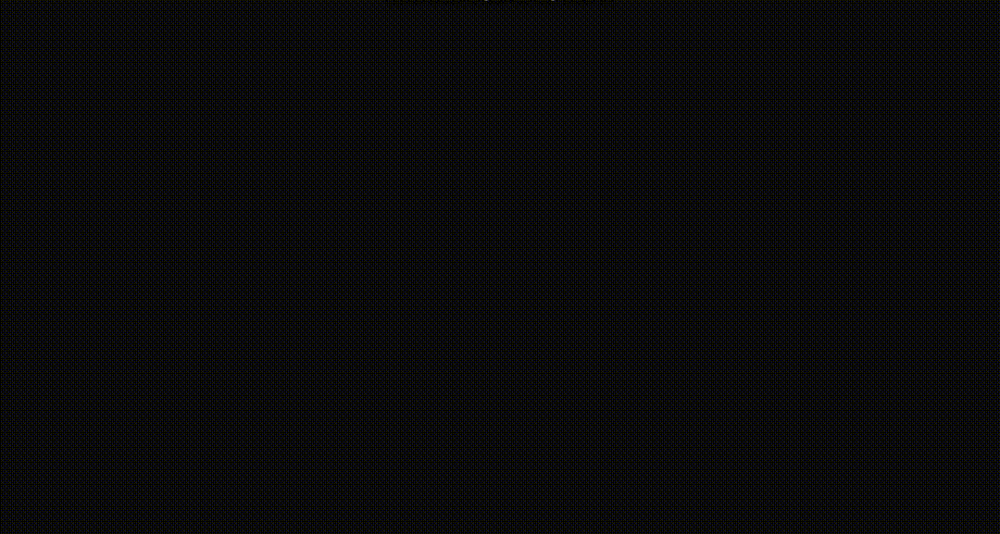

<div align="center">

  
  <h1>Knight's tour problem solver</h1>
  
  <p>
    Solving the KnightTour problem with C++ - https://vrgl.ir/IB9LJ
  </p>
  <p>Based on Warnsdorff’s Rule</p>
  </div>
<br />
  

<!-- About the Project -->
## :star2: About the Project


<!-- Screenshots -->
### :camera: Screenshots

<div align="center"> 
  
</div>


<!-- Env Variables -->
### :key: Required inputs

To use this project, you will need to enter the required inputs

Board size : (n,m)  <br>
Knight's position : (x,y)

<!-- run -->
### :triangular_flag_on_post: run

To run this project, run

```bash
  g++ Knight'sTour.cpp
```

<!-- Roadmap -->
## :compass: Todo

* [x] Solve Knight's tour problem
* [x] Update readme 

<!-- Contact -->
## :handshake: Contact

- [https://github.com/SLFatemi](https://github.com/SLFatemi)


<!-- Acknowledgments -->
## :gem: Sources

 - [https://en.wikipedia.org/wiki/Knight%27s_tour](https://en.wikipedia.org/wiki/Knight%27s_tour)
